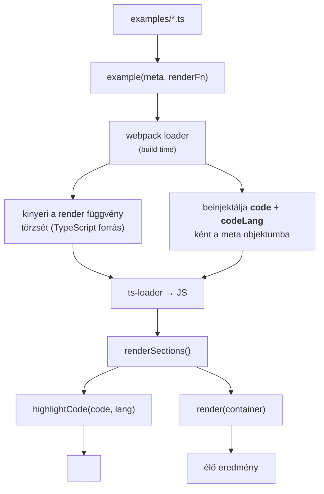

# Example Single Source of Truth (SoT) — Dokumentáció

## Bevezetés

A dokumentációs oldalon minden komponens-szekció **két dolgot** mutat:

1. a **kód-példát** (syntax-highlightolt `<pre><code>` blokk),
2. a **renderelt eredményt** (élő DOM elem).

Korábban ezt a kettőt **kézzel, kétszer** írtuk meg minden szekcióban. Ez számos problémához vezetett:

- **Elcsúszás (drift):** a megjelenített kód és a ténylegesen futó kód eltért egymástól
- **Dupla karbantartás:** minden API-változásnál két helyen kellett javítani
- **Nincs garancia a helyességre:** a `code` string sosem fordult le, így lejárt/hibás kódot mutathatott

**A SoT megoldás célja:** a példát **egyszer** írjuk le (a `render` függvényben), és ebből az egy forrásból származzon **mind** a megjelenített kód, **mind** a renderelt eredmény.

---

## Adatfolyam



---

## Érintett fájlok

| Fájl | Szerep |
|------|--------|
| `documentation/page-components/example.ts` | DSL helper: `example()`, `ExampleMeta`, `DocSection` |
| `scripts/example-loader.mjs` | Webpack loader: AST-alapú kódkinyerés és -injektálás |
| `webpack.config.mjs` | Loader regisztráció (`documentation/examples`-re szűkítve) |
| `documentation/page-components/initPage.ts` | `renderSections()` — a `DocSection[]` feldolgozása |
| `documentation/page-components/index.ts` | Re-exportok |
| `documentation/examples/*.ts` | 16 példafájl, mindegyik `example()`-ra átírva |

---

## Használat

### Új példa hozzáadása

```typescript
import { example } from "../page-components/index";
import { createButton } from "../../src/index";

const section = example(
  { title: "createButton", description: "Általános button elem szöveggel." },
  (parent) => createButton({ parent, id: "btn1", text: "Gomb", click: () => console.log("clicked") }),
);
```

**Fontos konvenciók:**

1. A container paraméter **mindig `parent`** legyen
2. Használj **shorthand property**-t az objektum átadásánál: `{ parent, ... }` (nem `{ parent: c, ... }`)
3. A `code` és `codeLang` mezőket **nem kell** kézzel megadni — a loader automatikusan kitölti
4. A `render` függvény lehet **expression body** vagy **block body** — a loader mindkettőt kezeli

### Expression body vs Block body

**Expression body** (ajánlott, ha egyetlen kifejezés):
```typescript
(parent) => createButton({ parent, id: "b1", text: "Gomb" })
```
→ A megjelenített kód: `createButton({ parent, id: "b1", text: "Gomb" })`

**Block body** (szükséges, ha több utasítás):
```typescript
(parent) => {
  createAlert({ parent, id: "a1", type: "success", message: "OK" });
  createAlert({ parent, id: "a2", type: "error", message: "Hiba" });
}
```
→ A megjelenített kód:
```
createAlert({ parent, id: "a1", type: "success", message: "OK" });
createAlert({ parent, id: "a2", type: "error", message: "Hiba" });
```

A loader automatikusan eltávolítja a külső kapcsos zárójeleket és a felesleges indentálást.

### Példák tömbként

Ha több példát kell egyszerre megjeleníteni:

```typescript
const sections = [
  example(
    { title: "createTextInput", description: "Szöveg input." },
    (parent) => createTextInput({ parent, id: "t1", labelText: "Név:" }),
  ),
  example(
    { title: "createButton", description: "Gomb." },
    (parent) => createButton({ parent, id: "b1", text: "Küldés" }),
  ),
];

renderSections(sections);
```

---

## Architektúra

### 1. `example(meta, renderFn)` — DSL helper

- Bemenet: metaadatok (`{ title, description }`) + egy arrow függvény
- Kimenet: `DocSection` objektum (`{ title, description, code, codeLang, render }`)
- Futásidőben a `code` mezőt a loader által beinjektált értékből olvassa
- Fallback: ha a loader nem futott (pl. fejlesztés közben), `render.toString()`-szal állítja elő a kódot

### 2. `scripts/example-loader.mjs` — webpack loader

**Működése:**

1. Gyors szűrés (`hasExampleCalls`): regex-szel ellenőrzi, hogy a fájl tartalmaz-e `example()` hívást
2. Parsing: `@babel/parser` TypeScript pluginnal elemzi a forrást
3. Gyűjtés: `collectExampleCalls()` rekurzívan bejárja az AST-t és összegyűjti az összes `example()` hívást
4. Fordított sorrend: a hívásokat **csökkenő** forráspozíció szerint rendezi, így a korábbi (fájlban előrébb lévő) hívások pozíciói nem változnak a későbbi injekciók miatt
5. Kódkinyerés: minden hívásnál kivágja a második argumentum (arrow függvény) törzsének forrásszövegét
6. Normalizálás:
   - Expression body: változatlanul hagyja
   - Block body: eltávolítja a `{ }` kapcsos zárójeleket és a felesleges indentálást
7. Injektálás: `code` + `codeLang` mezőket ad a meta objektumhoz, közvetlenül a záró `}` elé
8. Továbbadás: a módosított forrást adja tovább a `ts-loader`-nek

**Kritikus részletek:**
- A loaderek fordított sorrendben futnak (`use: ["ts-loader", "./scripts/example-loader.mjs"]`)
- A fájlokat `include`-szal szűrjük a `documentation/examples` könyvtárra
- A `@babel/parser` AST-pozícióit használja, nem regex-t — így stringek, template literálok és beágyazott kapcsos zárójelek sem zavarják meg

### 3. Webpack konfiguráció

```javascript
// documentationConfig.module.rules
{
  test: /\.ts$/,
  include: path.resolve(__dirname, "documentation/examples"),
  use: [
    { loader: "ts-loader", options: {...} },
    path.resolve(__dirname, "scripts/example-loader.mjs"),
  ],
},
```

A `documentationConfig`-ban két `.ts` rule van:
1. **Első:** csak `documentation/examples/*.ts` fájlokra — custom loader + ts-loader
2. **Második:** minden más `.ts` fájlra (pl. demók, page-components) — csak ts-loader

### 4. renderSections() — megjelenítés

Változatlan maradt. A `DocSection[]` tömböt kapja, és minden szekcióhoz:
- Létrehoz egy HTML szekciót a címmel, leírással, kódblokkal és eredmény konténerrel
- A `section.code`-ot a `highlighter.ts` segítségével syntax-highlightolja
- A `section.render(container)`-t meghívja az élő DOM létrehozásához

---

## Migrációs útmutató

### Régi stílus (elavult)

```typescript
// RÉGI — ne használd!
{
  title: "createButtonInput",
  description: "Input gomb.",
  code: `createButtonInput({\n  parent: "#app",\n  id: "btnInput",\n  text: "Button input",\n});`,
  codeLang: "typescript",
  render: (c) => createButtonInput({ parent: c, id: "b1", text: "Button input" }),
},
```

### Új stílus

```typescript
// ÚJ — egy forrás, nincs duplikáció
example(
  { title: "createButtonInput", description: "Input gomb." },
  (parent) => createButtonInput({ parent, id: "b1", text: "Button input" }),
),
```

### Lépések új példa hozzáadásához

1. Importáld az `example` függvényt: `import { example } from "../page-components/index";`
2. Hívd meg az `example()`-ot a meta objektummal és a render függvénnyel
3. A `parent` paramétert használd shorthand-del az objektumokban
4. Ha több példád van, tedd őket egy tömbbe, és hívd meg a `renderSections()`-t

---

## Fejlesztési megjegyzések

### `buildPage.ts` — demo oldalak, nem érintettek

A `documentation/page-components/buildPage.ts` egy külön `PageSection`/`buildPage()` implementáció a demókhoz (`demos/*.ts`). A demo oldalak **nem tartalmaznak kódpéldákat**, így a SoT megoldás rájuk nem vonatkozik — nem szükséges migrálni őket.

### Fallback mechanizmus

Az `example()` függvény tartalmaz egy `toString()` fallback-et arra az esetre, ha a loader nem futott (pl. külső eszközből, vagy fejlesztés közben). Ez egyszer kiír egy warning-ot a konzolra, utána csendben működik.

### Loader hibakezelés

Ha a loader parse-olási hibába ütközik, az eredeti (nem módosított) forrást adja tovább, hogy a build ne törjön el. A hibaüzenet a konzolra kerül.

### Függőségek

A loader a `@babel/parser` csomagot használja a TypeScript forrás elemzéséhez. Ez a `devDependencies` között van.

---

## Hibakeresés

### A loader kimenetének ellenőrzése

Futtasd a loadert egy adott fájlra:

```bash
node -e "
import { readFileSync } from 'fs';
const { default: loader } = await import('./scripts/example-loader.mjs');
const source = readFileSync('documentation/examples/buttons.ts', 'utf8');
console.log(loader(source));
"
```

### Gyakori hibák

| Hiba | Ok | Megoldás |
|------|-----|----------|
| `code` ismeretlen property | `ExampleMeta`-ban nincs `code` mező | Hozzá kell adni (`code?: string`) |
| `TS2353: Object literal may only specify known properties` | TypeScript excess property check | Add hozzá a mezőt a típushoz |
| Dupla vessző `,,` a kódban | A `needsDelimiter` check nem vette észre a meglévő vesszőt | Frissítsd a `injectCode`-ban a feltételt |
| "Unterminated string constant" | A loader pozíciói eltolódtak (több hívás esetén) | A hívásokat fordított sorrendben kell feldolgozni |
