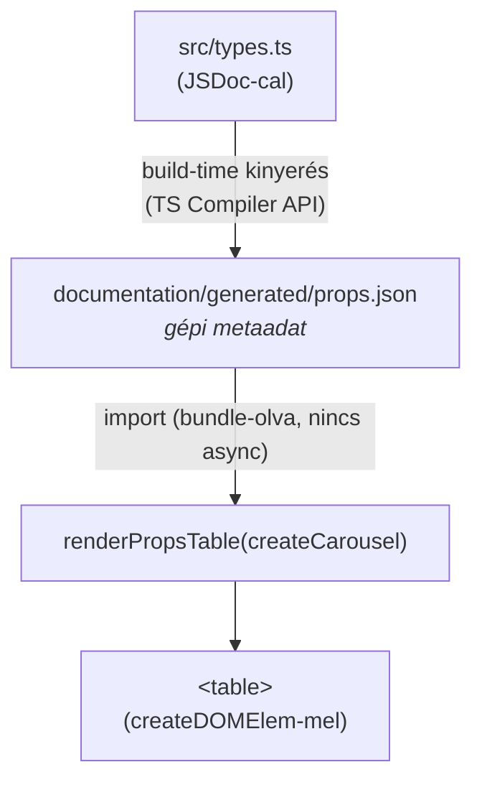

# Props-táblázat automatikus generálása a kódból — Terv

## 1. Cél

Minden komponens-példához **automatikusan** generálódjon egy paraméter-táblázat (prop neve, típusa, kötelező-e, alapérték, leírás) — **a komponens TypeScript típusdefiníciójából**, ne kézzel.

Referencia a kívánt végeredményre: [carousel.html](documentation/carousel.html) / [carousel.ts](documentation/examples/carousel.ts), ahol jelenleg **kézzel** van megírva két táblázat (`Paraméterek`, `CarouselSlide paraméterek`).

---

## 2. Jelenlegi állapot

A táblázatok ma kézzel, `createCard` + `table` formában készülnek a példa-fájlban — lásd [carousel.ts:106-175](documentation/examples/carousel.ts#L106-L175):

```ts
{ tag: "tr", children: [
  { tag: "td", text: "showArrows" },
  { tag: "td", text: "boolean" },
  { tag: "td", text: "Nyíl megjelenítése (alapértelmezett: true)" },
]},
```

A típusdefiníció ([src/types.ts:560-567](src/types.ts#L560-L567)) viszont **nem tartalmaz leírást**:

```ts
export interface CarouselParams {
  parent: HTMLElement | string;
  id: string;
  class?: string;
  slides: CarouselSlide[];
  showArrows?: boolean;
  showDots?: boolean;
}
```

**Problémák:**

- **Dupla forrás + drift:** a típus és a táblázat külön él; egy új prop a típusban nem jelenik meg a táblázatban.
- **Kézi munka komponensenként:** ~50+ komponens, mindegyikhez kézi tábla.
- **Hibalehetőség:** elgépelt típus/optionalitás, hiányzó sor.

Ez ugyanaz a drift-probléma, amit a [pelda-egy-igazsagforras-terv.md](plans/pelda-egy-igazsagforras-terv.md) old meg a kód-példáknál — ott az `example(meta, render)` helper **már be is van vezetve** ([carousel.ts:9](documentation/examples/carousel.ts#L9)). Ide ennek a párját készítjük el a props-táblázatokra.

---

## 3. Mi generálható automatikusan, és mi igényel JSDoc-ot

A típusból **közvetlenül** kinyerhető:

| Oszlop | Forrás | Automatikus? |
|--------|--------|--------------|
| Paraméter neve | property neve | ✅ |
| Típus | property típusa (`HTMLElement \| string`, `CarouselSlide[]`, `boolean`) | ✅ |
| Kötelező / opcionális | `?` jelölés | ✅ |
| Alapérték | JSDoc `@default` tag | ⚠️ JSDoc kell |
| Leírás | property feletti JSDoc `/** … */` | ⚠️ JSDoc kell |

**Következtetés:** a leírás és az alapérték legyen a **típusdefiníció JSDoc-jában** — így a `types.ts` lesz a props-dokumentáció **egyetlen igazságforrása**, és a leírás a típus mellett, vele együtt karbantartva él.

```ts
export interface CarouselParams {
  /** Szülő elem */
  parent: HTMLElement | string;
  /** Egyedi azonosító */
  id: string;
  /** Egyedi CSS osztály */
  class?: string;
  /** Slide-ok tömbje */
  slides: CarouselSlide[];
  /**
   * Nyíl megjelenítése
   * @default true
   */
  showArrows?: boolean;
  /**
   * Dot indikátorok megjelenítése
   * @default true
   */
  showDots?: boolean;
}
```

---

## 4. Architektúra



### 4.1 Kinyerő szkript — `scripts/gen-props.mjs`

A TypeScript Compiler API-val (`ts.createProgram` + `TypeChecker`):

1. Minden `createX` exportált függvénynél kiolvassa az **első paraméter típusát** (pl. `createCarousel` → `CarouselParams`).
2. A típus property-jeit bejárja: **név, típus-string** (`checker.typeToString`), **opcionalitás** (`symbol.flags & Optional` / `?`), **leírás** (`symbol.getDocumentationComment`), **alapérték** (`@default` JSDoc tag a `getJsDocTags`-ből).
3. **Követi a hivatkozott névvel rendelkező objektum-típusokat** (pl. `CarouselSlide[]` → `CarouselSlide`), és azokhoz külön bejárást készít → így automatikusan megszületik a második táblázat is.
4. Kimenet: `documentation/generated/props.json`:

```jsonc
{
  "createCarousel": { "paramsType": "CarouselParams" },
  "CarouselParams": {
    "props": [
      { "name": "parent", "type": "HTMLElement | string", "required": true,  "default": null,  "description": "Szülő elem" },
      { "name": "slides", "type": "CarouselSlide[]",       "required": true,  "default": null,  "description": "Slide-ok tömbje" },
      { "name": "showArrows", "type": "boolean",           "required": false, "default": "true","description": "Nyíl megjelenítése" }
    ],
    "refs": ["CarouselSlide"]
  },
  "CarouselSlide": { "props": [ /* … */ ], "refs": [] }
}
```

A `package.json` `build:page` scriptje elé fűzve: `node scripts/gen-props.mjs && webpack && node scripts/build-page.mjs`.

### 4.2 Runtime — `renderPropsTable`

Új `documentation/page-components/propsTable.ts`:

```ts
import propsData from "../generated/props.json";
import { createDOMElem } from "domelemjs";
import { t } from "./i18n";   // ha az i18n bevezetésre kerül

// Komponens-függvény vagy típusnév alapján.
export function propsTable(component: Function | string): HTMLElement {
  const key = typeof component === "string" ? component : component.name;
  const typeName = (propsData as any)[key]?.paramsType ?? key;
  const cards: HTMLElement[] = [];
  collectTypes(typeName).forEach((tn) => cards.push(renderTypeCard(tn)));
  return wrap(cards);
}
```

- `collectTypes` a fő típusból kiindulva a `refs` mentén összegyűjti a hivatkozott típusokat (dedup) → fő tábla + al-táblák egy hívásból.
- `renderTypeCard` ugyanazt a `createCard` + `table` markupot építi, mint ma a kézi verzió → vizuálisan változatlan.
- A `default` oszlop: ha `default != null`, „(alapértelmezett: true)" formában a leíráshoz fűzhető, vagy külön oszlopban.

A JSON **bundle-olva** (import), nem fetch — így **nincs async gating** (eltérően az i18n-tervtől).

---

## 5. Integráció a példákkal

A felhasználói igény: „minden kódpélda esetében". Mivel egy oldalon több példa **ugyanazt** a komponenst használja (a carousel-nél 4 példa, 1 komponens), a táblázatot **komponensenként egyszer** rendereljük (dedup), nem példánként duplikálva.

Két illesztési mód:

### 5.1 Az `example()` helper bővítése (ajánlott)

A meglévő `example(meta, render)` ([initPage.ts](documentation/page-components/initPage.ts) / SoT-terv) `meta`-ja kapjon egy opcionális `component` mezőt:

```ts
example(
  { title: "Alap Carousel", description: "…", component: createCarousel },
  (parent) => createCarousel({ parent, id: "demo-carousel-1", slides: [...], showArrows: true, showDots: true }),
);
```

A `renderSections` a szekciók renderelése után összegyűjti az **egyedi** `component`-eket, és mindegyikhez egyszer beszúr egy `propsTable(component)`-et (a lista alján vagy az első előfordulásnál). Így a táblázat „a kódból" jön, és nincs duplikáció.

### 5.2 Explicit, oldal-szintű hívás (alternatíva)

A példa-fájl maga hívja: `app.appendChild(propsTable(createCarousel));` — egyszerű, de a hozzárendelés kézi.

**Ajánlás:** 5.1, mert a `component` a példa mellett, deklaratívan él, és a `renderSections` automatikusan elhelyezi + deduplikálja.

---

## 6. Lehetőségek a kinyerésre — döntés

| Opció | Leírás | Döntés |
|-------|--------|--------|
| **TS Compiler API** | `ts.createProgram` + `TypeChecker`; teljes kontroll a típus-stringre, opcionalitásra, JSDoc-ra, `@default`-ra, ref-követésre; nincs új runtime függőség | ⭐ **AJÁNLOTT** |
| **TypeDoc** | Standard JSON doc generátor TS+JSDoc-ból; robusztus, de nehéz dep és bőbeszédű JSON, amit utófeldolgozni kell | Alternatíva, ha amúgy is kell TypeDoc |
| Runtime reflexió | A TS típusok futásidőben törlődnek → lehetetlen | ❌ Elvetve |
| Kézi registry / dekorátorok | A „kódból automatikus" célt megszegi | ❌ Elvetve |

A `typescript` már devDependency ([package.json:52](package.json#L52)), így a Compiler API **plusz függőség nélkül** elérhető.

---

## 7. Implementációs lépések

1. [ ] **JSDoc feltöltése** a `*Params` (és hivatkozott) interfészeken [src/types.ts](src/types.ts)-ben: minden propra `/** leírás */`, opcionálisaknál `@default`. (Kezdés a carousel-lel mint pilot.)
2. [ ] `scripts/gen-props.mjs`: TS Compiler API kinyerő → `documentation/generated/props.json`. Ref-követés a nested típusokra.
3. [ ] `documentation/generated/` a `.gitignore`-ba (vagy verziózva, ha kívánatos a diff).
4. [ ] `documentation/page-components/propsTable.ts`: `propsTable(component)`, `collectTypes`, `renderTypeCard` (a meglévő kézi markup mintájára).
5. [ ] `example()` `meta.component` mező + `renderSections` dedup-os táblázat-beszúrás.
6. [ ] [carousel.ts](documentation/examples/carousel.ts) pilot: a két **kézi** táblázat törlése, `component: createCarousel` hozzáadása → a generált tábla átveszi.
7. [ ] Vizuális összevetés: a generált tábla egyezzen a régivel (oszlopok, sorrend, alapértékek).
8. [ ] **Kiterjesztés MINDEN dokumentációs oldalra** (lásd 8. szakasz): JSDoc + `component:` minden példa-fájlban, a meglévő kézi táblázatok törlése.
9. [ ] `package.json` `build:page`: `node scripts/gen-props.mjs` előrefűzése.
10. [ ] `npm run typecheck` + `npm run build:page` + ellenőrzés **minden oldalon**.

---

## 8. Kiterjesztés minden dokumentációs oldalra

A pilot (carousel) után a táblázat **az összes** dokumentációs oldalra kerüljön. Mivel a táblázatot a példa-fájl JS-e rendereli a HTML `<div id="app">`-jébe, **a `.html` fájlokat nem kell szerkeszteni** — minden oldal automatikusan megkapja a táblázatot, amint a hozzá tartozó `examples/*.ts` átáll (`component:` + a kézi tábla törlése), és a `*Params` típus JSDoc-ot kap.

### 8.1 Oldal → komponens leképezés

| Oldal (HTML) | Példa-fájl | Dokumentálandó komponens(ek) | Kézi tábla ma? |
|--------------|-----------|------------------------------|:--:|
| carousel.html | carousel.ts | `createCarousel` (+ `CarouselSlide`) | ✅ törölni |
| drawer.html | drawer.ts | `createDrawer` | ✅ törölni |
| menu.html | menu.ts | `createMenu` | ✅ törölni |
| draganddrop.html | draganddrop.ts | `createDragAndDropFileInput` | ✅ törölni |
| forms.html | forms.ts | `createTextInput`, `createTelInput`, `createUrlInput`, `createSearchInput`, `createEmailInput`, `createPasswordInput`, `createNumberInput`, `createDateInput`, `createDatetimeInput`, `createTimeInput`, `createMonthInput`, `createWeekInput`, `createCheckbox`, `createColorInput`, `createFileInput`, `createRangeInput`, `createForm` | – |
| buttons.html | buttons.ts | `createButtonInput`, `createSubmitInput`, `createResetInput`, `createButton` | – |
| selection.html | selection.ts | `createSelect`, `createRadio`, `createCustomSelect`, `createTextarea` | – |
| tables.html | tables.ts | `createTable` | – |
| lists.html | lists.ts | `createUnorderedList`, `createOrderedList` | – |
| navigation.html | navigation.ts | `createNav`, `createBreadcrumb`, `createTabs` | – |
| content.html | content.ts | `createCard`, `createGrid`, `createContainer`, `createParagraph`, `createTitle`, `createBlockquote`, `createCodeBlock`, `createImage`, `createLink`, `createDivider` | – |
| feedback.html | feedback.ts | `createAlert`, `createBadge`, `createSpinner`, `createProgressBar`, `createToast` | – |
| interactive.html | interactive.ts | `createAccordion`, `createTooltip` | – |
| modal.html | modal.ts | `createModal` | – |
| avatars.html | avatars.ts | `createAvatar` | – |
| customInputs.html | customInputs.ts | `createCustomDatePicker`, `createCustomWeekPicker`, `createCustomMonthPicker`, `createCustomDateTimePicker`, `createCustomDateRangePicker` | – |
| index.html | index.ts | (telepítés/áttekintés — **nincs** komponens-tábla) | n/a |

> A segéd-komponensek (pl. a `drawer.ts`-ben importált `createButton`/`createCard`/`createMenu`), amelyek csak a demó **felépítéséhez** kellenek, **nem** kapnak `component:`-et — csak az oldal által **bemutatott** komponens(ek). Az `index.html` áttekintő oldal kimarad.

### 8.2 Oldalankénti teendő (egységes recept)

Minden `examples/*.ts`-re:

1. [ ] A bemutatott komponens(ek) `*Params` típusának **JSDoc** feltöltése a [src/types.ts](src/types.ts)-ben (leírás + `@default`).
2. [ ] Minden `example(...)` `meta`-jába a megfelelő `component:` referencia.
3. [ ] Meglévő **kézi** táblázat (`createCard` + `table`) **törlése** a 4 érintett fájlból (carousel, drawer, menu, draganddrop).
4. [ ] Build + vizuális ellenőrzés az adott oldalon (HU és — ha az i18n él — EN).

### 8.3 Több komponens egy oldalon

A `forms.html`/`content.html`/`feedback.html` több komponenst is bemutat. A `renderSections` dedup-ja **komponensenként egy** táblázatot szúr be, a komponens **első előfordulásánál** (a szekciója után) — így minden bemutatott komponens megkapja a maga tábláját, helyes sorrendben, duplikáció nélkül.

### 8.4 Lefedettség-ellenőrzés

- [ ] `scripts/gen-props.mjs` **figyelmeztessen**, ha egy `examples/*.ts`-ben hivatkozott (`component:`) komponenshez nincs `*Params` bejegyzés a `props.json`-ban, vagy ha egy típuson hiányzik a JSDoc-leírás → így nem marad üres/hiányos tábla egyetlen oldalon sem.

---

## 9. Kockázatok és kapcsolódások

- **Bonyolult típusok megjelenítése:** unió/objektum-literál típusok (`{ text, href?, click? }`, `CreateDOMElemOptions`) hosszú/zajos `typeToString` kimenetet adhatnak. Kezelés: mélység-limit, a `CreateDOMElemOptions`-féle külső típusok rövidítése (nem bontjuk ki), inline objektum-típusok rövid formázása.
- **Mit dokumentáljunk a hivatkozott típusoknál:** csak a saját (projektbeli) interfészeket bontsuk al-táblába; a `domelemjs`-ből jövőket (`CreateDOMElemOptions`) hagyjuk leírás-szintnek, ne generáljunk hozzá táblát.
- **i18n kapcsolat:** a JSDoc-leírások **magyarul** íródnak (alapnyelv). Ha a [nyelvesites-i18n-terv.md](plans/nyelvesites-i18n-terv.md) bevezetésre kerül, a `renderTypeCard` a leírásokat `t()`-n vezesse át, és a magyar leírások kulcsként kerüljenek az `en.json`-ba. A típusnevek/prop-nevek **nem** fordítandók.
- **SoT kapcsolat:** ugyanaz a build-time-kinyerés filozófia, mint a [pelda-egy-igazsagforras-terv.md](plans/pelda-egy-igazsagforras-terv.md)-ben — érdemes a két kinyerő szkriptet (kód-forrás + props) egy közös `scripts/`-beli, TS Compiler API-ra épülő modulban összehangolni.
- **Generált fájl frissessége:** ha a `props.json` nincs verziózva, a `build:page` mindig regenerálja; ha verziózva van, a drift ellen a kinyerőt CI-ben is futtatni kell.
